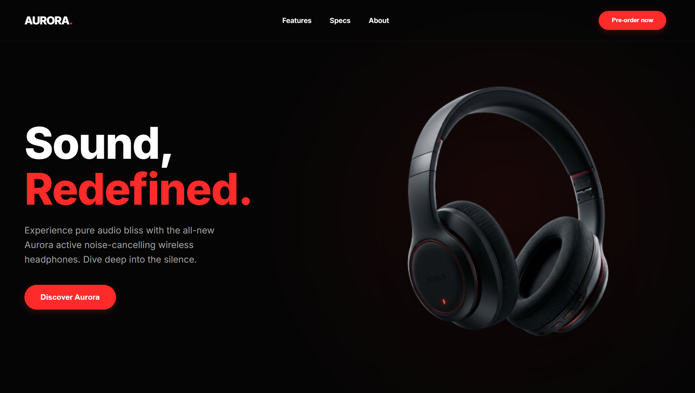
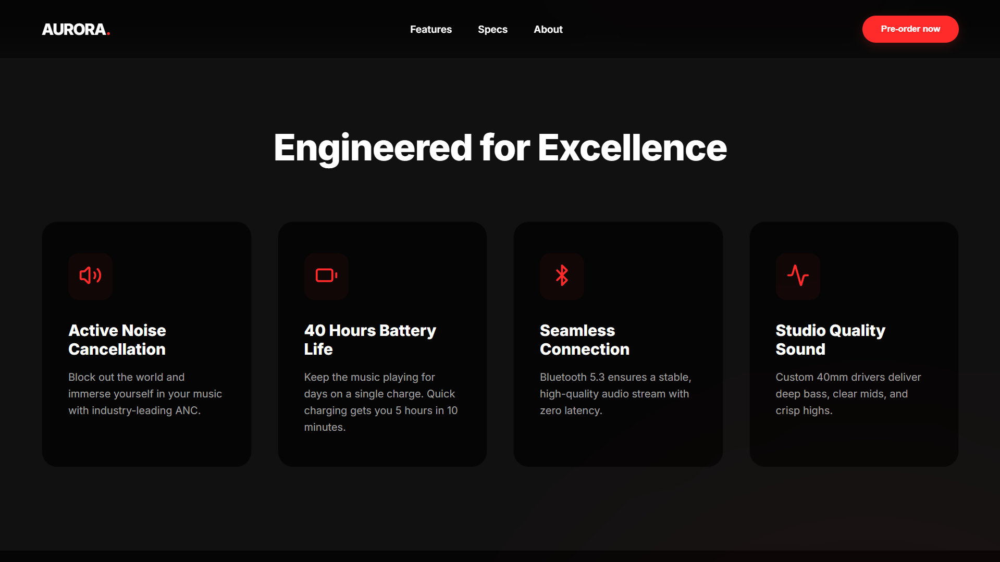
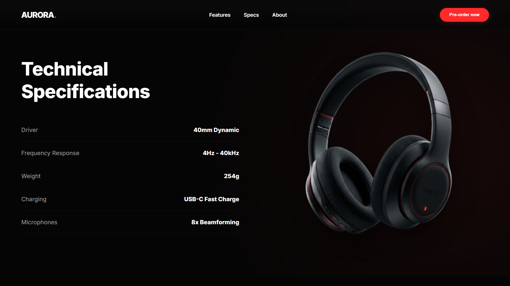
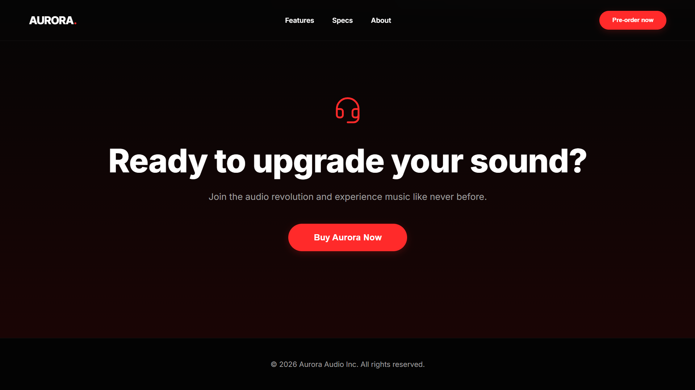

# Aurora - Premium Audio Landing Page 🎧

A modern, responsive, and visually striking landing page built for the fictional premium audio brand, **Aurora**. Designed with a minimalist brutalist-adjacent aesthetic, it relies on deep blacks, crisp whites, and vibrant red accents to deliver a premium user experience. 

The project leverages Framer Motion to provide buttery-smooth, scroll-linked animations that guide the user through the narrative of the product.

## Deployment Link
https://headphones-advert-website.vercel.app

## ✨ Features

- **Dynamic Scroll Animations:** Elements react naturally to scroll depth using `framer-motion` (`useScroll`, `useTransform`).
- **Responsive Design:** Completely adaptive layout that looks stunning on mobile, tablet, and desktop devices.
- **Glassmorphism Header:** A sleek, sticky navigation bar built with backdrop blurs.
- **Minimalist Aesthetic:** High-contrast design language that focuses on content and product imagery.
- **Custom Assets:** High-quality generated 3D headphone assets integrated seamlessly with atmospheric CSS glows.

## 📸 Screenshots

| Hero Section | Feature Grid |
|:---:|:---:|
|  |  |
| **Technical Specifications** | **Call to Action** |
|  |  |

## 🛠️ Technology Stack

- **Framework:** React 19 via Vite
- **Animations:** Framer Motion
- **Icons:** Lucide React
- **Styling:** Custom Vanilla CSS (`index.css`)

## 🎨 Design Decisions

- **Color Palette**: `#050505`, `#FFFFFF`, `#FF2A2A`
- **Typography**: Inter Google font
- **Performance**: Hidden scrollbars for cleaner UI

---

Designed and developed as a beautiful UI conceptualization project.

